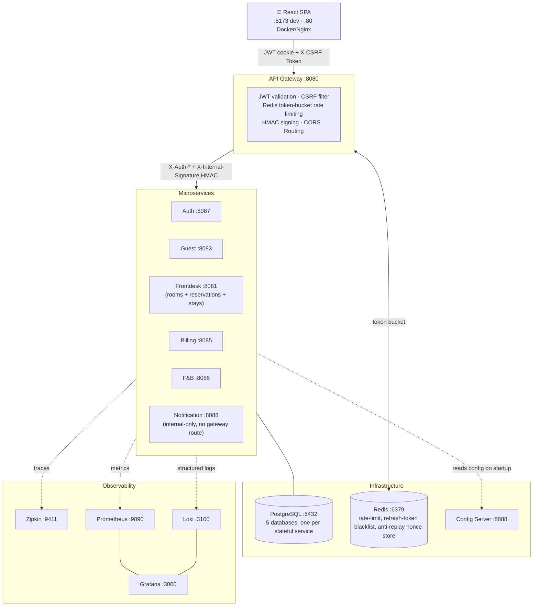

# 🏨 Enterprise Hotel PMS

[](https://github.com/serviciosdigitalesmx/hotel-pms-mexico/actions/workflows/ci.yml)
[](https://github.com/serviciosdigitalesmx/hotel-pms-mexico/actions/workflows/tenant-isolation.yml)
[](https://openjdk.org/projects/jdk/21/)
[](https://spring.io/projects/spring-boot)
[](https://react.dev)
[](https://www.typescriptlang.org/)
[](docker-compose.yml)

An enterprise-grade, microservices-based **Hotel Property Management System**.  
This platform orchestrates hotel operations — from reservations and guest management to food & beverage point-of-sale, billing, and housekeeping — powered by a modern React frontend and a highly scalable Spring Boot backend ecosystem.

---

## Project Status & Scope

This is a **production-grade enterprise PMS** validated for real hotel operations with a single property. The system meets the minimum bar for enterprise classification across all five dimensions below.

### Enterprise minimum bar — met

| Dimension | Requirement | This system |
|-----------|-------------|-------------|
| **Multi-tenancy** | Data isolated per tenant at row level, enforced by infrastructure | `hotel_id` NOT NULL on every entity; injected from verified JWT, never from client input; all repositories filter by `hotel_id` |
| **Security posture** | Hardened auth, inter-service trust, least-privilege access | JWT in httpOnly cookies (XSS-proof), HMAC-SHA256 on every Feign call (zero-trust internal), CSRF, Redis token-bucket rate limiting, RBAC enforced at gateway + endpoint level, GDPR Art. 20 + right-to-erasure |
| **Operational compliance** | Regulatory integrations handled in production | Alloggiati Web v2.0 SOAP (art. 109 TULPS) — two-step protocol, 168-char fixed-width format, CRLF, error codes; collaudo plan documented. FatturaPA FPR12 export — validated against the official AE XSD schema, immutable post-export snapshot, batch export for the commercialista (see `docs/COMPLIANCE_AUDIT_2026-08.md` for the full regulatory audit, including known gaps) |
| **Observability** | Distributed tracing, metrics, structured logging | Zipkin (trace propagation via `X-Correlation-ID`), Prometheus + Grafana, Loki, Spring Boot Actuator on all services |
| **Resilience** | Graceful degradation under partial failure | Resilience4j `@CircuitBreaker` on every Feign client; service outages do not cascade; RFC 7807 problem details from all services |

### Complete and production-ready

- 8 microservices + 1 shared PDF-rendering library, full RBAC (ADMIN / OWNER / RECEPTIONIST), JWT httpOnly + HMAC internal auth, CSRF, rate limiting
- Alloggiati Web v2.0 SOAP integration (art. 109 TULPS) — collaudo with real PS portal documented in [`docs/ALLOGGIATI_COLLAUDO_REALE.md`](docs/ALLOGGIATI_COLLAUDO_REALE.md)
- FatturaPA FPR12 export — XSD-validated, immutable post-export (`invoice_fiscal_exports`, `409 INVOICE_LOCKED_AFTER_EXPORT`), batch ZIP+CSV export for the commercialista. Direct SDI transmission is explicitly out of scope — see `backup/DECISIONS.md §2.5`
- F&B → room charge billing, walk-in check-in, multi-tenant data isolation (`hotel_id` on every entity)
- GDPR Art. 20 data export (backend), structured PII audit log, right-to-erasure anonymisation with automatic nightly retention job
- Encrypted off-site backup (pgBackRest, continuous WAL archiving, Backblaze B2) — RPO in minutes, restore verified manually end-to-end; automated CI restore drill exists but is currently blocked by the B2 free-tier daily transaction cap
- Transactional email (reservation confirmation, checkout summary) via `notification-service`
- Security hardening fully documented in `docs/security-report/report-secure-coding.tex`
- CI pipeline (GitHub Actions): build, unit tests, Playwright E2E, Trivy image scan

### Multi-hotel onboarding and WhatsApp

- A root platform `ADMIN` creates hotels from **Settings → Platform hotels** (`/platform/hotels`). Each creation receives a new tenant UUID and an initial `OWNER`; the owner must change the temporary password on first login.
- Hotel administrators and owners manage staff only inside their authenticated hotel. They cannot create tenants or select a client-supplied `hotelId`.
- **Tenant onboarding and isolation** is a dedicated GitHub Actions gate. It builds the current JVM services, starts disposable databases and containers, provisions two hotels through the real platform API, signs in as both owners, and verifies that settings, rooms, and guests cannot cross tenants—even with forged tenant headers.
- Each hotel links its WhatsApp number from `/settings/whatsapp`. Evolution instances are derived server-side as `pms-{hotelId}`; provider credentials never reach the browser. Linking a number does **not** activate automatic bot responses.
- Evolution runs as shared infrastructure with isolated persistent storage. For local development use `docker-compose.yml` together with `docker-compose.evolution.yml`; production still requires private networking, persistent volumes, backups, secret rotation, and reconnect testing.
- The public WhatsApp bot remains intentionally disabled until webhook authentication, idempotency, human handoff, retention, and PMS-only publishable-data policies are implemented and tested.

Implementation and operating boundaries: [`docs/EVOLUTION_MULTITENANT_ROLLOUT.md`](docs/EVOLUTION_MULTITENANT_ROLLOUT.md).

### Stable

- **Coverage**: JaCoCo (≥40% instruction, enforced floor) and Vitest (stmt/branch/fn/lines) thresholds are enforced in CI — build fails if coverage drops below minimums. See [Coverage](#coverage-measured-2026-08-04) below for current real numbers, well above the enforced floor.
- **CVE-2026-42577** (Netty epoll DoS): accepted residual risk — JDK NIO transport is active, Netty 4.2.x is not yet compatible with the fix; mitigated by network-layer isolation

### Roadmap

Future implementations are documented in detail in [`docs/ROADMAP.md`](docs/ROADMAP.md).

**Next priorities:**
- Prometheus alert rules (error rate, latency, container restarts)
- Two regulatory gaps found by [`docs/COMPLIANCE_AUDIT_2026-08.md`](docs/COMPLIANCE_AUDIT_2026-08.md) that were not tracked anywhere before: **imposta di soggiorno** (tourist tax, entirely absent) and **corrispettivi telematici** (Horeca-wide legal obligation since 2026-01-01, entirely absent)

_Already completed:_ `@Version` on `Invoice` ✓ · `restart: unless-stopped` on all containers ✓ · Operations Runbook ✓ · Automated encrypted off-site backup (pgBackRest, RPO in minutes) ✓ · FatturaPA FPR12 export ✓

**Main commercial gaps (Sprint 2–3):**
- Channel Manager OTA — prerequisite for 80% of the hotel market
- SMS booking confirmations (email confirmations already implemented)
- Nota di credito flow to correct an already-exported FatturaPA invoice
- Mobile PWA (70% of infrastructure already in place)
- Booking Engine + Stripe Checkout

See [`docs/ROADMAP.md`](docs/ROADMAP.md) for the full roadmap with effort estimates, dependencies, competitor matrix, and Enterprise SaaS timeline.

See [`docs/COMPLIANCE_AUDIT_2026-08.md`](docs/COMPLIANCE_AUDIT_2026-08.md) and [`docs/EXPLORATORY_TEST_2026-08.md`](docs/EXPLORATORY_TEST_2026-08.md) for the current evidence-based gaps and known bugs. `docs/FINAL_AUDIT_ULTRA_SEVERE.md` is the original 2026-05 audit, kept as historical reference.

---

## Tech Stack

| Layer | Technology |
|-------|-----------|
| **Language (Backend)** | Java 21 |
| **Language (Frontend)** | TypeScript 5.x |
| **Backend Framework** | Spring Boot 3.5.x, Spring Cloud 2025.0 |
| **Frontend Framework** | React 19, Vite 7.x |
| **State Management** | Zustand |
| **Styling** | Tailwind CSS 3.x |
| **Internationalization** | i18next + react-i18next (EN / IT) |
| **API Gateway** | Spring Cloud Gateway (WebFlux / Reactive) |
| **Auth** | JWT (HMAC-SHA256) – stateless, cookie-based |
| **Rate Limiting** | Spring Cloud Gateway + Redis Token Bucket |
| **Database** | PostgreSQL 15 (one DB per microservice) |
| **Migrations** | Flyway |
| **ORM / Mapping** | Spring Data JPA, MapStruct, Lombok |
| **Resilience** | Resilience4j (Circuit Breaker on Feign clients) |
| **Observability** | Zipkin (distributed tracing), Prometheus (metrics), Spring Boot Actuator |
| **Code Quality** | PMD via `gradle-java-qa` plugin (zero-warning policy) |
| **Testing (Backend)** | JUnit 5 + Mockito |
| **Testing (Frontend)** | Vitest (unit), Playwright (E2E), vitest-axe (a11y) |
| **Build** | Gradle (Kotlin DSL), npm |
| **Containerization** | Docker, Docker Compose |

---

## Architecture Overview

The system follows a **distributed microservices** pattern with centralized configuration and an API Gateway as the single entry point.



### Ports Map

| Service | Port | Type |
|---------|------|------|
| React Frontend (dev) | `5173` | Frontend |
| Frontend (Docker/Nginx) | `80` | Frontend |
| API Gateway | `8080` | Edge Gateway |
| Config Server | `8888` | Infrastructure |
| Auth Service | `8087` | Microservice |
| Guest Service | `8083` | Microservice |
| Frontdesk Service (rooms, reservations, stays) | `8081` | Microservice |
| Billing Service | `8085` | Microservice |
| F&B Service | `8086` | Microservice |
| Notification Service | `8088` | Microservice (internal-only, not routed by the gateway) |
| PostgreSQL | `5432` | Database |
| Redis | `6379` | Cache |
| Zipkin | `9411` | Tracing |
| Prometheus | `9090` | Metrics |

> All client traffic should go through the **API Gateway** on port `8080`, which enforces JWT validation, CORS policies, and rate limiting.

---

## Performance & Rate Limits

Design targets for single-property deployment (≤ 20 concurrent hotel staff users):

| Endpoint group | Sustained rate | Burst capacity | Notes |
|---|---|---|---|
| `POST /api/v1/auth/login` | 5 req/s | 10 req | Per client IP — brute-force mitigation |
| `GET|POST /api/v1/auth/users/**` | 10 req/s | 20 req | Per authenticated user |
| All other `/api/v1/**` | 20 req/s | 50 req | Per authenticated user |

Rate limits are enforced by Spring Cloud Gateway's Redis token-bucket (`RequestRateLimiterGatewayFilterFactory`). Clients exceeding the limit receive `429 Too Many Requests` with `Retry-After: 1` and a RFC 9110 problem details body.

> **Note:** No formal load testing has been performed. The figures above are the configured gateway limits, not measured throughput ceilings.

---

## Key Technical Decisions & Trade-offs

Non-obvious choices made during development, with the reasoning behind each.

| Decision | Chosen approach | Why | Alternative not chosen |
|---|---|---|---|
| **Service topology** | One PostgreSQL DB per stateful microservice (5 DBs — `frontdesk-service` consolidates rooms/reservations/stays behind a single DB per ADR-001) | True data isolation; no cross-service SQL JOINs; independent schema evolution via Flyway | Shared DB: simpler but creates coupling, blocks independent deployments, risks GDPR data leakage across tenants |
| **Auth token storage** | JWT in httpOnly cookies | Eliminates XSS token theft — browser never exposes the token to JavaScript | `localStorage`: simpler but vulnerable to XSS; rejected as a non-negotiable security baseline |
| **Internal service auth** | HMAC-SHA256 on every Feign call (`X-Internal-Signature`) | Zero-trust between services: a compromised internal network cannot forge calls without the shared secret | Mutual TLS: stronger but requires certificate infrastructure not yet justified at this scale |
| **Guest full-text search** | PostgreSQL `pg_trgm` GIN index | ILIKE `%keyword%` goes from O(n) full-table scan to O(log n) index scan; no additional infrastructure | Elasticsearch / OpenSearch: more powerful but adds a full search cluster for a problem PostgreSQL solves natively at single-hotel volumes |
| **Invoice collection loading** | `@NamedEntityGraph` + `@EntityGraph` on repository | Eliminates N+1: `findByHotelId(pageable)` loads `charges` + `payments` in one LEFT JOIN instead of N separate queries per row | `@Transactional` + `Hibernate.initialize()`: works but couples service logic to persistence internals |
| **Concurrent billing writes** | `@Version` optimistic locking on `Invoice` | F&B and billing can both add charges; Hibernate raises `OptimisticLockException` on conflict instead of silently overwriting data | Pessimistic lock (`SELECT FOR UPDATE`): serialises all writes, degrades throughput unnecessarily for low-contention workloads |
| **Resilience** | Resilience4j `@CircuitBreaker` on all Feign clients | Graceful degradation: if `frontdesk-service` is down, GDPR export returns partial data; check-in is never blocked by a `billing-service` outage | No circuit breaker: simpler code but a single service failure cascades to full system outage |
| **Multi-tenancy** | `hotel_id` column on every entity, injected from JWT via API Gateway | Row-level isolation with no application-layer complexity; `hotel_id` is extracted from the verified JWT, never from client input; enforced at build time by an ArchUnit rule (`TenantIsolationArchTest`) so a missing-scope query fails CI, not production | Schema-per-tenant: stronger isolation but 5× schema management overhead per hotel added; Postgres Row-Level Security evaluated (ADR-004) and rejected — the real leaks found were missing application-layer filters, not something RLS would have caught better, and it adds real operational cost (`SET LOCAL` per request) |
| **Why microservices at this scale** | 8 deployable services (`frontdesk-service` merges the former inventory/reservation/stay-service per ADR-001, since the actual bounded context — the shared Room↔Reservation↔Stay aggregate — was one domain split across 3 unrelated databases, not 3 independent ones) | Each remaining domain (billing, frontdesk, guests, F&B, auth, notifications) has a genuinely distinct data model and lifecycle; boundary design anticipates multi-hotel SaaS scaling and eventual Kubernetes deployment | Monolith: faster initial development but mixing billing/stay/GDPR domains creates long-term coupling that is harder to isolate for compliance audits |

---

## How to Run

### TL;DR — up and running in 1 command

```bash
# Linux / macOS
chmod +x start.sh && ./start.sh

# Windows PowerShell
.\start.ps1

# Windows CMD
start.bat
```

The script auto-generates `.env` with random secrets on first run — no manual setup needed.  
To customise Alloggiati PS credentials beforehand: `cp .env.example .env` and edit it first.

Open **http://localhost:5173** · Login: `admin` / `password` · Password change required on first login.

---

### Prerequisites

- **Java 21** (JDK)
- **Node.js 18+** & **npm**
- **Docker** & **Docker Compose**

### One-Click Startup

Use the provided scripts to boot the entire ecosystem. Each script will:
1. Run a pre-flight port check
2. Ensure Docker Desktop is running
3. Generate HMAC / JWT secrets (first time only)
4. Build all microservices with `./gradlew clean build -x test`
5. Start all Docker containers (`docker compose --profile observability up -d --build`) — dev stack, all ports exposed on host
6. Wait for the **Config Server** to become healthy
7. Wait for the **API Gateway** to become healthy
8. Install frontend dependencies (if needed) and start the Vite dev server

> **Production deployment**: `start.sh`/`start.ps1`/`start.bat` are for local/dev
> use only — they run the dev `docker-compose.yml` with every port exposed on
> the host. For a real production deploy, use `docker-compose.prod.yml` (port
> hardening — only `:80`/`:8080` published) instead; see
> [`docs/DEPLOYMENT_GUIDE.md`](docs/DEPLOYMENT_GUIDE.md) §4.

```bash
# Linux / macOS
chmod +x start.sh && ./start.sh

# Windows CMD
start.bat

# Windows PowerShell
.\start.ps1
```

Once all services are running, open **http://localhost:5173** in your browser.

### Environment Variables

The startup script auto-generates `.env` with strong random secrets on first run. To override defaults (e.g. real Alloggiati PS credentials), copy `.env.example` to `.env` and edit before running. Key variables:

| Variable | Description | Default |
|----------|-------------|---------|
| `INTERNAL_HMAC_SECRET` | Shared secret for internal service-to-service auth (auto-generated by setup script) | — |
| `JWT_SECRET` | JWT signing secret (auto-generated by setup script) | — |
| `POSTGRES_PASSWORD` | PostgreSQL superuser password (auto-generated by setup script) | — |
| `CONFIG_SERVER_PASSWORD` | Spring Cloud Config Server HTTP basic auth password (auto-generated) | — |
| `ALLOGGIATI_USERNAME` | Polizia di Stato portal username | `ci_placeholder_user` |
| `ALLOGGIATI_PASSWORD` | Polizia di Stato portal password | `ci_placeholder_password` |
| `ALLOGGIATI_WS_KEY` | PS web service key | `ci_placeholder_wskey` |
| `ALLOGGIATI_DRY_RUN` | `true` = skip real SOAP calls (safe for development) | `true` |

### Operational Limits

| Limit | Detail |
|-------|--------|
| **No automated deployment** | GitHub Actions CI runs tests and Trivy scans on push; no push-to-deploy pipeline. |
| **CI restore drill currently blocked** | Backup itself is automated end-to-end (pgBackRest, continuous WAL archiving, encrypted off-site copy to Backblaze B2, RPO in minutes — restore verified manually, real data, real bucket). Only the *automated* GitHub Actions restore drill is currently blocked by the B2 free-tier daily transaction cap; see `docs/OPERATIONS_RUNBOOK.md`. |
| **No Kubernetes yet** | Infrastructure is Docker Compose only. K8s manifests are planned post-exam. All containers are stateless and K8s-ready by design (`restart: unless-stopped` on all services). |
| **Single region / single node** | No geographic redundancy. Each service runs as a single container with a single PostgreSQL instance. |
| **No SMS notifications** | Reservation confirmation and checkout summary emails are sent via `notification-service`. SMS is not implemented — no requesting client has needed it yet (see `backup/DECISIONS.md`). |
| **Grafana CVE residue** | Grafana 11.5.0 Alpine layer carries unpatched OS-level CVEs (OpenSSL, musl, zlib). Dismissed as "won't fix" — internal monitoring tool, no guest PII, isolated Docker network. Documented in `report-secure-coding.tex` §DEP-CVE-04. |

---

## Default Admin Credentials

The system is seeded with a default administrator account on first boot:

| Field | Value |
|-------|-------|
| **Username** | `admin` |
| **Password** | `password` |
| **Email** | `admin@hotel.com` |
| **Role** | `ADMIN` |

> ⚠️ **Change the default password** in any non-development environment.

### First login

On first login the system forces a password change — no operations are available until a new password is set. The redirect to `/profile` is automatic and mandatory.

Password policy: ≥16 characters, 2 uppercase, 2 digits, 2 special characters.

After changing the password, complete the initial setup before starting operations:

1. **Hotel Profile** (`/profile/hotel`) — name, address, VAT number, fiscal code, logo
2. **Room types** (`/rooms`) — define types (Single, Double, Suite) with rates and capacity
3. **Rooms** — add physical rooms with number and type
4. **F&B menu** (`/restaurant`) — add menu items with prices (ADMIN/OWNER only)
5. **User accounts** (`/admin/users`) — create receptionist accounts with temporary passwords

---

## Project Structure

```
hotel-pms/
├── api-gateway/           # Spring Cloud Gateway (JWT validation, rate limiting, routing)
├── auth-service/          # Authentication & user management (JWT issuance)
├── billing-service/       # Invoices and payment tracking
├── config-service/        # Spring Cloud Config Server (native profile)
├── fb-service/            # Food & Beverage / Restaurant POS
├── guest-service/         # Guest profile management
├── frontdesk-service/     # Rooms + reservations + check-in/check-out + Alloggiati (ADR-001 consolidation, package-by-feature: rooms/ reservations/ stays/)
├── notification-service/  # Transactional email (reservation confirm, checkout) — internal-only
├── pdf-template-engine/   # Shared library (plain Java, no Spring): renders fiscal PDFs for billing-service
├── frontend/              # React SPA (Vite + TypeScript + Tailwind)
├── docker/                # Docker init scripts (PostgreSQL multi-DB setup)
├── docs/                  # Technical documentation (architecture, security, user manual, audit)
├── docker-compose.yml     # Full production-grade compose file
├── start.sh               # One-click startup (Linux/macOS)
├── start.bat              # One-click startup (Windows CMD)
├── start.ps1              # One-click startup (Windows PowerShell)
├── setup-hmac-secret.sh   # HMAC secret generator (Linux/macOS)
└── setup-hmac-secret.ps1  # HMAC secret generator (Windows PowerShell)
```

---

## Testing

### Backend (JUnit 5 + Mockito)
```bash
./gradlew clean build              # Runs all tests + PMD + Checkstyle
./gradlew test jacocoTestReport    # Tests + JaCoCo coverage reports (HTML + XML)
# Reports: {service}/build/reports/jacoco/test/html/index.html
```

### Frontend Unit Tests (Vitest)
```bash
cd frontend
npm run test                       # Run once
npm run test:coverage              # Run once + V8 coverage report
# Report: frontend/coverage/index.html
```

### Frontend E2E Tests (Playwright)
```bash
cd frontend
npm run test:e2e
```

### Coverage (measured 2026-08-04)

| Layer | Statements | Branches | Functions | Lines |
|-------|-----------|----------|-----------|-------|
| Frontend (Vitest V8) | 90.4% | 82.3% | 85.0% | 94.1% |
| Backend aggregate (JaCoCo, weighted across all 11 modules) | 76.6% instr. | 65.2% | — | 73.0% |

Thresholds enforced since 2026-05-16 (`dab4eea`) — CI floor is intentionally conservative
(40% backend instruction) to allow incremental growth without blocking merges; actual
coverage runs well above it, as shown above. `functions` on the frontend sits below the
other three by design: `App.tsx`'s `React.lazy()` route factories only count as covered
once that specific route is visited in a test — see `vite.config.ts` comment.

See [`docs/PILOT_READINESS_AUDIT.md §5b`](docs/PILOT_READINESS_AUDIT.md) for the older
per-service breakdown (numbers there predate this measurement, kept for gap-analysis
history, not as a current baseline).

---

## Branch Overview

| Branch | Role |
|--------|------|
| `main` | Active development — build green, all tests pass. All work now lands here directly |
| `pre-secure-coding` | Baseline snapshot before security hardening (exam reference) — architecturally stale, pre-dates the `frontdesk-service` consolidation, not a clean "pre-hardening-only" diff anymore |
| `feature/secure-coding-hardening` | Full security hardening history — SHA cited in LaTeX report. Merged, frozen |
| `feature/frontdesk-consolidation` | ADR-001: merges former inventory/reservation/stay-service into `frontdesk-service`. Merged, frozen |
| `feature/frontend-development` | Historical — merged, ~257 commits behind `main`. Not an active development base despite the name |

See [`docs/BRANCH_STRATEGY.md`](docs/BRANCH_STRATEGY.md) for full topology and governance rules.

---

## Documentation

| Document | Description |
|----------|-------------|
| [`docs/security-report/report-secure-coding.tex`](docs/security-report/report-secure-coding.tex) | **Secure Coding exam report (LaTeX source)** — full security hardening documentation with threat model, mitigations, and commit references. The compiled PDF in the same folder currently lags the `.tex` source (local `pdflatex`/MiKTeX has a pre-existing babel-italian package issue, unrelated to report content) — treat the `.tex` as authoritative |
| [`THREAT_MODEL.md`](THREAT_MODEL.md) | Threat model — attack surfaces, mitigations table with commit references (security exam artifact) |
| [`docs/COMPLIANCE_AUDIT_2026-08.md`](docs/COMPLIANCE_AUDIT_2026-08.md) | **Regulatory compliance audit** — 11 Italian/EU legal obligations checked against the actual codebase (Alloggiati, FatturaPA, GDPR, imposta di soggiorno, corrispettivi telematici, antiriciclaggio, and more) |
| [`docs/EXPLORATORY_TEST_2026-08.md`](docs/EXPLORATORY_TEST_2026-08.md) | Live unscripted exploratory test findings — bugs found testing the running stack out of the "happy path" order |
| [`docs/FINAL_AUDIT_ULTRA_SEVERE.md`](docs/FINAL_AUDIT_ULTRA_SEVERE.md) | Production-readiness audit (2026-05) — evidence-based, open gaps, accepted risks, roadmap |
| [`docs/PILOT_READINESS_AUDIT.md`](docs/PILOT_READINESS_AUDIT.md) | Pilot readiness assessment (2026-05) — all critical blockers resolved at the time; coverage numbers there are historical, see [Coverage](#coverage-measured-2026-08-04) above for current |
| [`docs/AUDIT_ANALISI_2026-07.md`](docs/AUDIT_ANALISI_2026-07.md) | Independent verification of 4 external analyses against the real codebase (2026-07) |
| [`docs/LIVE_E2E_AUDIT_2026-07.md`](docs/LIVE_E2E_AUDIT_2026-07.md) | Live browser E2E audit against the running Docker stack (2026-07), 14 items, closed |
| [`docs/SECURITY_AND_PRIVACY.md`](docs/SECURITY_AND_PRIVACY.md) | Security model: JWT, HMAC, RBAC, CSRF, GDPR, TULPS compliance |
| [`docs/legal/PRIVACY_DPA_COOKIE_BRIEF.md`](docs/legal/PRIVACY_DPA_COOKIE_BRIEF.md) | Technical brief for legal counsel — data processed, legal bases, retention, sub-processors, ready for Privacy Policy/DPA/Cookie Policy drafting |
| [`docs/INTERACTION_FLOWS.md`](docs/INTERACTION_FLOWS.md) | 12 end-to-end service call chains (check-in, billing, walk-in, GDPR export, …) |
| [`docs/USER_MANUAL.md`](docs/USER_MANUAL.md) | Step-by-step procedures for all user roles |
| [`docs/ALLOGGIATI_README.md`](docs/ALLOGGIATI_README.md) | Polizia di Stato SOAP integration — configuration and architecture |
| [`docs/DOCUMENTAZIONE_TECNICA_ALLOGGIATI_PS.md`](docs/DOCUMENTAZIONE_TECNICA_ALLOGGIATI_PS.md) | Deep-dive: WSDL bindings, field mapping, error codes, TULPS legal context |
| [`docs/ALLOGGIATI_COLLAUDO_REALE.md`](docs/ALLOGGIATI_COLLAUDO_REALE.md) | Real-portal test plan — 18 test cases, Go/No-Go criteria |
| [`docs/C1_NOTIFICATION_SERVICE.md`](docs/C1_NOTIFICATION_SERVICE.md) | ADR: `notification-service` design (sync Feign + Resilience4j vs alternatives) |
| [`docs/I18N.md`](docs/I18N.md) | i18n architecture, namespace conventions, anti-hardcoding rules |
| [`docs/GAP_ANALYSIS.md`](docs/GAP_ANALYSIS.md) | Historical gap analysis (2026-05, all items resolved as of that date — predates the `frontdesk-service` consolidation) |
| [`docs/BRANCH_STRATEGY.md`](docs/BRANCH_STRATEGY.md) | Branch topology, merge history, governance rules |
| `backup/DECISIONS.md` | All binding architectural and business decisions — rationale, constraints, non-negotiable rules. **Not linked**: this file is gitignored (contains working notes), not published to the repository — internal reference only |
| [`docs/ROADMAP.md`](docs/ROADMAP.md) | Enterprise roadmap — 4 sprints from Pilot-ready to Enterprise SaaS, competitor matrix, pricing model |
| [`SECURITY.md`](SECURITY.md) | Responsible disclosure policy, in-scope vulnerabilities, accepted risks, security contact |
| [`CONTRIBUTING.md`](CONTRIBUTING.md) | Developer onboarding, commit conventions, branch strategy, testing patterns |
| [`CHANGELOG.md`](CHANGELOG.md) | Release history |
| [`docs/OPERATIONS_RUNBOOK.md`](docs/OPERATIONS_RUNBOOK.md) | Operational procedures — start/stop, backup, ADMIN recovery, log reading, credentials update |
| [`docs/DEPLOYMENT_GUIDE.md`](docs/DEPLOYMENT_GUIDE.md) | Production deployment — server requirements, HTTPS, nginx, firewall, update procedure |
| [`docs/API_REFERENCE.md`](docs/API_REFERENCE.md) | API reference — auth flow, main endpoints, error codes, rate limiting (note: predates the FatturaPA export batch endpoints added 2026-08-03, see `docs/API_REFERENCE.md` for the caveat) |

---

## API Stability

All endpoints under `/api/v1/` are stable within the current major version. Breaking changes (removed fields, changed semantics, authentication requirements) will increment the path prefix to `/api/v2/`. No `/api/v2/` endpoints exist in the current release.

| Guarantee | Scope |
|---|---|
| **Stable** | All `/api/v1/**` request/response shapes |
| **Internal** | `X-Auth-*`, `X-Internal-Signature` headers — consumed by services only, not by external clients |
| **No guarantee** | Actuator endpoints (`/actuator/**`) — management use only, exposed on port `:8090`, not through the public gateway |

---

## Security

Found a vulnerability? See [SECURITY.md](SECURITY.md) for the responsible disclosure policy.

**Do not** open a public GitHub issue for security findings — private disclosure first.

---

## License

This project is open source and available for evaluation, adaptation, and deployment.
